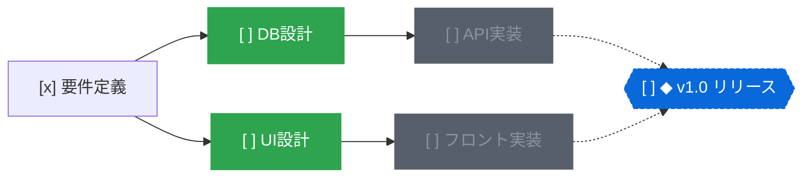

# topo

すべてのタスクとマイルストーンを単一の有向非巡回グラフ（DAG）として管理する、ローカルファーストのタスク管理システム。

[English](README.md) | 日本語

[](https://www.rust-lang.org/)
[](https://zed.dev/)
[](#1ノード1ファイルのgit親和ストレージ)
[](https://opensource.org/licenses/MIT)

https://github.com/user-attachments/assets/3fc7a9c6-5b60-459d-b1a9-038c4c9115a7

## 概要

一般的なToDoリストは「フラットな一覧」か「階層フォルダ」でタスクを管理する。  
しかし、現実のプロジェクトにおけるタスクは「Aが完了しないとBに着手できない」という依存関係を持つ。

リストやフォルダによる管理では、タスクが増えるにつれて「今どれに着手すべきか」の判断が困難になる。  
依存関係が不可視なため、着手不能なタスクに時間を奪われたり、重要なボトルネックを見落としたりしやすい。

`topo` は、タスク間の依存関係（`depends_on`）とマイルストーンの構成関係（`in`）をDAGとしてモデル化する。  
トポロジカルソートにより、前提タスクがすべて完了した「今すぐ着手できるタスク」のみを抽出する。



上記の状態において、`topo ready` を実行すると着手可能なタスク（`DB設計`、`UI設計`）のみが出力される。  
`DB設計` を完了すると、ブロックされていた `API実装` が自動的に着手可能状態へ遷移する。

## 特徴

### 依存関係に基づく着手可能タスクの抽出（`topo ready`）

- 前提条件がすべて満たされたタスクのみをフィルタリング
- 他タスクにブロックされている作業が視界に入らず、次に着手すべき作業に集中可能
- サイクル（循環参照）の発生はモデル検証により未然に防止

### クリティカルパスとマイルストーン進捗の算出

- マイルストーン達成までの最長依存経路（クリティカルパス）を自動計算
- 全体の工期に直結するボトルネックタスクの特定
- マイルストーンの進捗率（完了数/全タスク数）および残りステップ数を可視化

### 1ノード1ファイルのGit親和ストレージ

- 各タスク・マイルストーンは `.topo/nodes/<id>.md` として保存
- YAMLフロントマター（メタデータ）とMarkdown本文（メモ・詳細）で構成
- 単一ファイル分割により、Gitのマージコンフリクトを最小化
- ブランチ運用、Pull Requestでの差分レビュー、外部エディタでの閲覧が容易

### 3種類のインターフェース

- **CLI**: スクリプト連携やパイプライン処理に適したコマンド群。全コマンドで `--json` をサポート
- **TUI**: ターミナル上で動作するキーボード主体の軽量ダッシュボード
- **Native GUI**: GPUI（ZedエディタのUIエンジン）を採用したGPUアクセラレーション動作のグラフエディタ。ズーム、パン、ドラッグ＆ドロップによる依存線接続、リアルタイムファイル同期に対応

### AIエージェントおよびローカル決定モデル連携

- **エージェント向けスキル**: AIエージェントがタスクを分解・登録・実行するための指示セット（`SKILL.md`）を同梱
- **アトミック更新（`topo apply`）**: JSON配列による複数タスク・依存関係の一括トランザクション更新
- **モデル支援によるグラフ整理（`topo organize`）**: Jev互換の決定モデル（System One）と連携し、欠落している依存関係の推定、未分類タスクの配置、重複タスクの検出を提案

## クイックスタート

### インストール

Linux・Windows・macOS 向けCLIとmacOS向けGUIのビルド済みバイナリを
[GitHub Releases](https://github.com/r4ai/topo/releases)から取得できる。
インストール・チェックサム検証・リリース手順は[リリースガイド](docs/releasing.md)を参照。

ソースからビルドする場合は、`rust-toolchain.toml`で固定したRust 2024 edition対応ツールチェーンを使用する。

```bash
# クローン
git clone https://github.com/r4ai/topo.git
cd topo

# CLIのインストール
cargo install --path crates/topo-cli

# GUIのビルドと起動（任意）
cargo run -p topo-gui --release
```

### 基本操作フロー

```bash
# 1. ワークスペースの作成（.topo ディレクトリが生成される）
topo init

# 2. マイルストーンの作成（生成されたIDが出力される）
topo add "v1.0 リリース" --milestone
# => a1b2c3

# 3. タスクの作成とマイルストーンへの割り当て
topo add "設計書作成" --in a1b2c3
# => d4e5f6

# 4. 依存関係を指定して後続タスクを追加
topo add "実装作業" --dep d4e5f6 --in a1b2c3
# => 7g8h9i

# 5. 今すぐ着手できるタスクの確認（設計書作成のみが表示される）
topo ready
# => [ ] d4e5f6  設計書作成

# 6. ステータスの更新
topo status d4e5f6 doing
topo status d4e5f6 done

# 7. 再度 ready を確認（実装作業がアンブロックされて表示される）
topo ready
# => [ ] 7g8h9i  実装作業

# 8. マイルストーンの進捗とクリティカルパスを確認
topo milestones
# => [ ] a1b2c3  ◆ v1.0 リリース  █████░░░░░ 1/2  1 step(s) left on critical path

# 9. 依存グラフの出力（Mermaid形式またはTree形式）
topo graph --format mermaid
topo graph --format tree
```

## インターフェース

### CLI

構造化出力には `--json` を使う。`ls`・`ready`・`milestones` とグラフ走査コマンドでは `--format text|ids|tsv|jsonl` も選べる。一覧の既定出力はリダイレクト時もテキスト、走査コマンドはID列となる。

`status`・`edit`・`rm`・`join`・`leave`・`link`・`unlink` の第1引数に `-` を指定すると、標準入力の空白区切りID列を一括処理する。IDと変更を全件検証してから保存し、空入力では何も変更しない。`topo ls -` では入力されたIDを一覧のフラグで絞り込める。

```bash
topo ready --format ids | topo status - doing
topo ls --tag gui --format ids | topo ls - --due-before 2026-10-31 --format ids | topo join - a1b2c3
topo deps a1b2c3 --transitive | topo ls - --blocked --format tsv
topo ready --format jsonl | jq -r 'select(.status == "todo") | .id'
```

### TUI (`topo tui`)

ターミナル上で動作するダッシュボード。

- `1`〜`4`: ビュー切り替え（Ready, Milestones, Open, All）
- `Tab`: 次のビューへ切り替え
- `j` / `k` または 矢印キー: カーソル移動
- `Space`: 次のステータスへ循環変更（`todo` → `doing` → `done` → `todo`）
- `x`: ステータスを直接 `done` に変更
- `d`: ステータスを直接 `dropped` に変更
- `u`: ステータスを直接 `todo` に変更
- `q` / `Esc`: 終了

### Native GUI (`topo-gui`)

Zedエディタのレンダリング基盤であるGPUIによるネイティブデスクトップアプリ。外部のCLIやGitによる変更をリアルタイムに検知して画面を更新する。

- キャンバス操作:
  - ドラッグ（背景・カード・中ボタン） / トラックパッドスクロール: キャンバスのパン
  - マウスホイール / ピンチ / `Cmd` + スクロール: ズーム（ポインター位置中心）
  - 2本指ダブルタップ: 全体表示と実寸表示の切り替え
  - `Cmd+=` / `Cmd+-` / `Cmd+0`: ズームイン / ズームアウト / 実寸表示
  - `f`: キャンバス全体を表示（Fit）
- 右パネル（インスペクタ）:
  - 左端をドラッグ: パネル幅を変更（キャンバスが潰れないようクランプ）
  - 選んだ幅はユーザー設定に保存され、次回起動時も保持（ワークスペースには保存しない）
  - タイトルは最大3行で折り返し、溢れる1行表示は末尾を `…` に統一
  - DETAILS の各行はその場で編集: 行をクリックするか対応キー（`p` 優先度、`a` 担当者、`d` 期日、`t` タグ）を押す。`Enter` で確定、`Esc` または他の場所のクリックでキャンセル。保存できない入力は欄を開いたまま理由を行の下に表示
  - 入力欄はコードエディタの補完のように動く: 下の行を動かさない浮動リストに、優先度、ワークスペースで使われている担当者とタグ、入力に応じた期日（`3` → `+3d`・`+3w`・`+3m`・3日、`fr` → `friday`）を表示。先頭の一致がハイライトされ、欄内に薄い文字で補完され、`Enter` で確定。`↓` / `↑` またはクリックで別の候補を選ぶ。`Esc` でリストを閉じると入力した文字をそのまま保存でき、もう一度 `Esc` でキャンセル
  - タグはチップとして編集: スペースかカンマで入力どおりに確定、空の欄で `Backspace` を押すと最後のタグを削除、`×` で個別に削除
  - `Tab` / `Shift+Tab` で欄を保存して次 / 前の欄へ移動（優先度 → 担当者 → 期日 → タグ → PR）
  - 作成・更新・完了日時をローカルタイムゾーンで読み取り専用表示（日時の記録より前のノードは `Unknown`）
  - PULL REQUESTS に関連 PR を一覧表示: `g` または `+` で登録（URL か `owner/repo#123`）、クリックでブラウザで開く、`×` で解除
- ノード操作:
  - クリック: ノードを選択（`Cmd` / `Ctrl` + クリックで複数選択、ステータス変更や削除を一括適用）
  - `n`: 新規タスクの作成
  - `m`: 新規マイルストーンの作成
  - `Tab`: 選択ノードの後続タスク（follow-up）を作成
  - `Shift+Tab`: 選択ノードの前提タスク（prerequisite）を作成
  - `Shift` + ドラッグ または ハンドルからドラッグ: 依存関係の接続（タスクをマイルストーンに落とすとメンバーに追加、何もない場所に落とすと後続タスクを作成）
  - `l` / `Shift+l`: 既存ノードを一覧から選び、前提 / 後続として接続
  - `i`: タスクをマイルストーンに追加（マイルストーン選択時はメンバーのタスクを追加）
  - `Space`: ステータスの循環切り替え
  - `x`: `done` 状態のトグル
  - `1`〜`4`: ステータスの直接指定（Todo, Doing, Done, Dropped）
  - `p` / `a` / `d` / `t`: 優先度 / 担当者 / 期日 / タグを右パネルで編集
  - `g`: PR を紐付ける
  - `Shift+p`: 指定した優先度未満のノードを薄く表示（urgent → high 以上 → medium 以上 → 優先度あり → すべて）
  - `Enter` / `r` / `F2` / ダブルクリック: タイトルの編集
  - `o`: ノードの Markdown ファイル（ノート）を既定のエディタで開く
  - 矢印キー: 依存関係に沿って（左右）または同じ列の中で（上下）選択を移動
  - `c`: 選択ノードを中央に表示（複数選択時は全体を表示）
  - `Backspace` / `Delete`: ノードの削除
  - `Cmd+A`: 全ノードを選択（優先度フィルタで薄くなっていないもの）
  - `Cmd+C` / `Cmd+X` / `Cmd+V`: 選択ノードのコピー / 切り取り / 貼り付け。貼り付けは新しい ID の `todo` ノードとして複製し、複製同士のリンクを保つ。担当者・PR・日時はコピーしない。他のアプリには Markdown のリストとして渡る
  - `Cmd+Z` / `Cmd+Shift+Z`: アンドゥ / リドゥ
  - 入力欄（プロンプト、検索、右パネルの行）にフォーカスがある間は、`Cmd+A/C/X/V/Z/Shift+Z` はその文字列に作用し、キャンバスのキーは文字として入力される。Edit メニューも同じ規則に従い、実行できない項目は無効になる
  - `/` または `Cmd+K` / `Cmd+F`: タイトル・タグ・IDによる検索
  - `?`: キーバインドヘルプの表示

#### ヘッドレススクリーンショット

`screenshot` フィーチャでビルドすると、ディスプレイやOSの画面収録権限なしでウィンドウをオフスクリーン描画して PNG に保存できます:

```bash
cargo run -p topo-gui --features screenshot -- \
  --screenshot qa.png --width 1360 --height 860 --select <id>
```

`--select` はID1つまたはカンマ区切りの複数（存在しないIDはエラー）、`--inspector-width` はパネル幅の指定（省略時は保存済みの設定を使わず、ウィンドウ幅から決定）、`--edit <field>` と `--type <text>` は選択ノードの DETAILS の行を編集状態で開き、`--help-overlay` はショートカット一覧を表示します。サイズは整数のポイントで指定し、ディスプレイより大きいサイズはエラーになります。全オプションは `topo-gui --help` で確認できます。視覚QAとドキュメント用です。

## AI・自動化との連携

### バッチ適用 (`topo apply`)

複数ノードの追加や依存関係の構築をアトミックに適用する。途中でエラーやサイクルが発生した場合は一切の変更が行われない。

```bash
topo apply --json <<'EOF'
[
  {"op": "add", "ref": "m", "title": "v2.0", "kind": "milestone"},
  {"op": "add", "ref": "spec", "title": "API仕様策定", "in": ["$m"]},
  {"op": "add", "ref": "impl", "title": "API実装", "depends_on": ["$spec"], "in": ["$m"]},
  {"op": "status", "id": "$spec", "status": "doing"}
]
EOF
```

### 決定モデルによるグラフ整理 (`topo organize`)

ローカルで動作するJev互換モデル（`POST /v1/systemone`）に問い合わせ、グラフ構造の最適化案を取得する。

```bash
topo organize deps --json        # 不足している依存関係の推定
topo organize place --json       # 未分類タスクの所属マイルストーン推薦
topo organize dupes --json       # 重複の疑いがあるタスクの検出
topo organize prioritize --json  # 着手可能タスクの優先度スコアリング
```

`--apply` を指定すると、サイクルを形成しない妥当な提案のみを自動で適用する。

## クラウドワークスペース

ワークスペースを `.topo/nodes` の代わりにサーバーに置き、複数の端末や並列に動く AI エージェントで 1 つのグラフを共有できる。サーバーは Cloudflare Workers と D1 で動く。設計とデプロイ手順は [docs/cloud](docs/cloud/README.md) を参照。

```bash
# GitHub でサインイン（デバイスフロー）し、ローカルのワークスペースをサーバーへ移す
topo login --url https://topo.example.com
topo cloud push --url https://topo.example.com

# 以降のコマンドはサーバーを読み書きする。TUI と GUI はサーバーをポーリングする
topo ready

# エージェント用に、このワークスペース限定のトークンを発行する
topo token create --name agent-1 --workspace <workspace-id> --expires 90d

# エージェントは TOPO_TOKEN を設定してタスクを確保する。複数が競合しても成功するのは 1 つ
topo status <id> doing --if todo --assign "$TOPO_AGENT"
```

リンクは `.topo/config.toml` の `[cloud]` テーブルに保存される。秘密情報を含まないためコミットできる。`topo cloud pull` はノードを Markdown ファイルへ書き戻し、リンクを解除する。

## コマンドリファレンス

| コマンド | 説明 | 主要引数・フラグ |
| :--- | :--- | :--- |
| `topo init` | ワークスペース（`.topo`）の初期化 | |
| `topo ready` | 着手可能なタスクの一覧表示 | `--under <id>`, `--sort priority`, `--format <text\|ids\|tsv\|jsonl>` |
| `topo milestones` | マイルストーン一覧・進捗率・クリティカルパスの表示 | `--format <text\|ids\|tsv\|jsonl>` |
| `topo add <title>` | タスクまたはマイルストーンの作成 | `--milestone`, `--dep <id>`, `--in <ms>`, `--due <date>`, `--tag <tag>`, `--priority <low\|medium\|high\|urgent>`, `--assignee <name>`, `--pr <url\|owner/repo#N>`, `--note <text>` |
| `topo link <from> <to>` | `<from>` が `<to>` に依存するエッジを追加 | |
| `topo unlink <from> <to>` | 依存関係の解除 | |
| `topo join <task> <ms>` | タスクをマイルストーンの構成員に追加 | |
| `topo leave <task> <ms>` | タスクをマイルストーンから除外 | |
| `topo status <id> <st>` | ステータス変更（`todo`, `doing`, `done`, `dropped`） | `--if <st>`（現在のステータスが一致しなければ失敗）, `--assign <name>`（同じアトミックな書き込みで担当者を設定） |
| `topo edit <id>` | ノード属性の変更 | `--title`, `--due`, `--no-due`, `--tag`, `--priority`, `--no-priority`, `--assignee`, `--no-assignee`, `--pr`, `--unpr`, `--note` |
| `topo rm <id>` | ノードおよび接続エッジの削除 | |
| `topo ls [-]` | ノードの一覧表示・入力IDの絞り込み | `--kind`, `--status`, `--under`, `--all`, `--tag`, `--in`, `--due-before`, `--due-after`, `--no-due`, `--ready`, `--blocked`, `--title`, `--priority`, `--assignee`, `--unassigned`, `--sort priority`, `--format` |
| `topo show <id>` | ノードの詳細（優先度・担当者・プルリクエスト・作成/更新/完了日時）・隣接ノード・メモの表示 | |
| `topo deps <id>` | 前提ノードの一覧（マイルストーンのメンバーも含む） | `--transitive`, `--format`, `--json` |
| `topo dependents <id>` | 指定ノードに依存するノードの一覧 | `--transitive`（所属関係もたどる）, `--format`, `--json` |
| `topo members <ms>` | マイルストーンの構成タスクの一覧 | `--format`, `--json` |
| `topo critical-path <id>` | 残る最長の依存経路を実行順に表示 | `--format`, `--json` |
| `topo graph` | グラフ構造の出力 | `--format [tree\|mermaid\|dot]`, `--under <id>` |
| `topo apply` | JSONバッチによるアトミック更新 | `[file]` または標準入力 |
| `topo organize <what>` | 決定モデルによるグラフ改善提案・適用 | `deps`, `place`, `dupes`, `kinds`, `prioritize`, `--apply`, `--under <id>` |
| `topo tui` | TUIダッシュボードの起動 | |
| `topo login` / `topo logout` | GitHub でクラウドサーバーにサインイン／トークンの失効と削除 | `--url <url>`, `--name <トークン名>` |
| `topo token <create\|ls\|revoke>` | クライアントやエージェント用トークンの管理 | `--name`, `--workspace <id>`, `--expires <90d>` |
| `topo cloud <push\|pull\|link\|ls>` | ワークスペースのサーバーへの移行・書き戻し・既存ワークスペースへのリンク・一覧 | `--url <url>`, `--name <name>` |
| `topo cloud <members\|invite\|remove>` | リンク中のワークスペースのメンバー一覧・追加・削除 | `--role <owner\|editor\|viewer>` |
| `topo cloud log` | リンク中のワークスペースの変更履歴 | `--after <version>` |

## プロジェクト構成

```text
.
├── crates/
│   ├── topo-core/  # DAG検証、トポロジカルソート、ファイルI/O
│   ├── topo-cli/   # CLIコマンド群、レンダラー、Ratatui TUI
│   ├── topo-gui/   # GPUIベースのネイティブデスクトップアプリ
│   ├── topo-jev/   # Jev互換決定モデルクライアント・整理ロジック
│   ├── topo-cloud/ # クラウドAPIのクライアント（サインイン、トークン、クラウド接続のワークスペース）
│   └── topo-server/ # クラウドAPI（Cloudflare Workers + D1）
├── docs/
│   └── cloud/      # クラウド版の設計
└── skills/
    └── topo/ # AIエージェント向け指示セット (SKILL.md)
```

## ライセンス

[MIT License](https://opensource.org/licenses/MIT)
