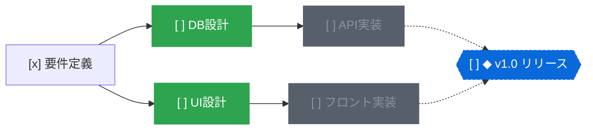

<div align="center">
  
  <h1>topo</h1>
  <p>タスクの依存関係をDAGで解きほぐす、ローカルファーストのタスクマネージャー</p>
  <p>
    <a href="README.md">English</a> | <strong>日本語</strong>
  </p>
  <p>
    <a href="https://www.rust-lang.org/"></a>
    <a href="https://zed.dev/"></a>
    
    <a href="LICENSE"></a>
  </p>
</div>

https://github.com/user-attachments/assets/3fc7a9c6-5b60-459d-b1a9-038c4c9115a7

## なぜ topo なのか

一般的なToDoリストは「フラットな一覧」や「フォルダ分け」でタスクを管理する。  
しかし、現実のプロジェクトにおけるタスクは「Aが完了しないとBに着手できない」という前提条件（依存関係）を持つ。

依存関係が見えないままタスクが増えると、何から手をつけるべきか判断できなくなる。  
まだ着手できないタスクに視界を奪われ、納期のボトルネックとなる作業連鎖を見落としやすい。

`topo` は、タスクとマイルストーンを単一のDAG（有向非巡回グラフ）としてモデル化する。  
トポロジカルソートにより、前提タスクがすべて完了した「今すぐ着手できるタスク」だけを自動抽出する。



上記の状態から `topo ready` を実行すると、着手可能なタスク（`DB設計` と `UI設計`）のみが出力される。  
`DB設計` を完了すると、ブロックされていた `API実装` が自動的に着手可能状態へ移行する。

## 主な特徴

- **今できる作業に集中（`topo ready`）**
  - 前提がすべて完了したタスクのみを表示
  - ブロック中のタスクを隠し、認知的負荷を最小化
  - サイクル（循環依存）の混入は書き込み時に自動防止
- **クリティカルパス分析**
  - マイルストーン達成までの最長依存経路を自動算出
  - プロジェクト全体の遅延に直結するボトルネックを可視化
  - 進捗バーと残りステップ数を即座に把握可能
- **Git親和性の高いMarkdownストレージ**
  - 1タスク1ファイル（`.topo/nodes/<id>.md`）形式で保存
  - YAMLフロントマターとMarkdown本文で構成
  - ファイル分割により、複数人でのブランチ運用でもマージコンフリクトを最小化
- **3つの高速インターフェース**
  - **CLI**: 全コマンドで `--json`、一覧系コマンドで `--format ids` をサポートし、Unixパイプライン連携に最適
  - **TUI**: ターミナル上で素早く状況を把握・更新できるキーボード完結型ダッシュボード
  - **Native GUI**: GPUI（Zedエディタのレンダリング基盤）を採用したGPUアクセラレーションキャンバス。滑らかなパン・ズーム、ドラッグ＆ドロップによる依存線接続、リアルタイムファイル同期を提供
- **AIエージェント親和性**
  - トランザクション一括更新（`topo apply`）により、複数タスクの生成・接続をアトミックに適用
  - Claude CodeやCodexなどのAIコーディングエージェント向け指示セット（`SKILL.md`）を同梱
- **シームレスなクラウド同期（オプション）**
  - Cloudflare Workers + D1 によるエッジ同期に対応
  - 複数デバイスや並行稼働するAIエージェント間で単一グラフを共有

## インストールとアップデート

### バイナリダウンロード

[GitHub Releases](https://github.com/r4ai/topo/releases) から Linux、macOS、Windows 向けのビルド済みCLIバイナリ、および macOS・Windows 向けGUIインストーラーを入手できる。

### ソースからビルド

```bash
git clone https://github.com/r4ai/topo.git
cd topo

# CLIのインストール
cargo install --path crates/topo-cli

# ネイティブGUIの起動（任意）
cargo run -p topo-gui --release
```

### アップデート

```bash
# ソースツリーから最新版を再インストール
git pull
cargo install --path crates/topo-cli --force
```

詳細な検証手順やパッケージ情報は [リリースガイド](docs/releasing.md) を参照。

## クイックスタート

```bash
# 1. ワークスペースの初期化（.topo ディレクトリが作成される）
topo init

# 2. マイルストーンの作成
topo add "v1.0 リリース" --milestone
# => a1b2c3

# 3. 前提タスクと後続タスクの登録
topo add "設計書作成" --in a1b2c3
# => d4e5f6

topo add "API実装" --dep d4e5f6 --in a1b2c3
# => 7g8h9i

# 4. 今すぐ着手できるタスクの確認（設計書作成のみが表示される）
topo ready
# => [ ] d4e5f6  設計書作成

# 5. ステータスを完了に更新
topo status d4e5f6 done

# 6. 再度 ready を確認（API実装が自動的にアンブロック）
topo ready
# => [ ] 7g8h9i  API実装

# 7. 進捗状況とクリティカルパスの確認
topo milestones
# => [ ] a1b2c3  ◆ v1.0 リリース  █████░░░░░ 1/2  1 step(s) left on critical path

# 8. 依存グラフの出力
topo graph --format mermaid
```

## 技術スタック

高速性と低遅延を追求したアーキテクチャを採用している。

| 技術 | 役割 | 選定理由 |
| :--- | :--- | :--- |
| **Rust** | コアエンジン / CLI / GUI | メモリ安全性、ミリ秒単位の超高速起動、リソース消費の最小化 |
| **GPUI** | ネイティブGUI | Zedエディタ由来のGPUアクセラレーションUIエンジン。数百ノード規模のグラフでも滑らかな描画を維持 |
| **Ratatui** | ターミナルUI（TUI） | キーボード主体の直感的な操作感と軽快な画面描画 |
| **Cloudflare Workers & D1** | クラウド同期 | サーバーレスエッジ環境による低遅延な同期処理とゼロメンテナンス運用 |

## ドキュメント

- [利用ガイド・コマンドリファレンス](docs/usage.ja.md): 全コマンドのオプション、パイプ連携、GUI/TUIの操作一覧、クラウド連携の詳細
- [開発者ガイド](docs/development.ja.md): リポジトリのクレート構成、ローカル環境構築、テスト・ベンチマークの実行方法
- [クラウド同期の設計と構築](docs/cloud/README.md): サーバーレスAPIの設計仕様とデプロイ手順
- [リリース手順](docs/releasing.md): タグ付け、バイナリビルド、チェックサム検証

## ライセンス

[MIT License](LICENSE)
