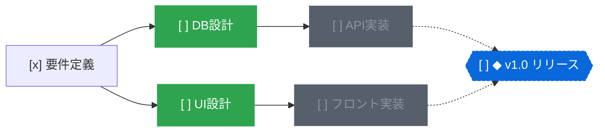

# topo

すべてのタスクとマイルストーンを単一の有向非巡回グラフ（DAG）として管理する、ローカルファーストのタスク管理システム。

[English](README.md) | 日本語

[](https://www.rust-lang.org/)
[](https://zed.dev/)
[](#1ノード1ファイルのgit親和ストレージ)
[](https://opensource.org/licenses/MIT)

https://github.com/user-attachments/assets/3fc7a9c6-5b60-459d-b1a9-038c4c9115a7

## 概要

一般的なToDoリストは「フラットな一覧」か「階層フォルダ」でタスクを管理する。  
しかし、現実のプロジェクトにおけるタスクは「Aが完了しないとBに着手できない」という依存関係を持つ。

リストやフォルダによる管理では、タスクが増えるにつれて「今どれに着手すべきか」の判断が困難になる。  
依存関係が不可視なため、着手不能なタスクに時間を奪われたり、重要なボトルネックを見落としたりしやすい。

`topo` は、タスク間の依存関係（`depends_on`）とマイルストーンの構成関係（`in`）をDAGとしてモデル化する。  
トポロジカルソートにより、前提タスクがすべて完了した「今すぐ着手できるタスク」のみを抽出する。



上記の状態において、`topo ready` を実行すると着手可能なタスク（`DB設計`、`UI設計`）のみが出力される。  
`DB設計` を完了すると、ブロックされていた `API実装` が自動的に着手可能状態へ遷移する。

## 特徴

### 依存関係に基づく着手可能タスクの抽出（`topo ready`）

- 前提条件がすべて満たされたタスクのみをフィルタリング
- 他タスクにブロックされている作業が視界に入らず、次に着手すべき作業に集中可能
- サイクル（循環参照）の発生はモデル検証により未然に防止

### クリティカルパスとマイルストーン進捗の算出

- マイルストーン達成までの最長依存経路（クリティカルパス）を自動計算
- 全体の工期に直結するボトルネックタスクの特定
- マイルストーンの進捗率（完了数/全タスク数）および残りステップ数を可視化

### 1ノード1ファイルのGit親和ストレージ

- 各タスク・マイルストーンは `.topo/nodes/<id>.md` として保存
- YAMLフロントマター（メタデータ）とMarkdown本文（メモ・詳細）で構成
- 単一ファイル分割により、Gitのマージコンフリクトを最小化
- ブランチ運用、Pull Requestでの差分レビュー、外部エディタでの閲覧が容易

### 3種類のインターフェース

- **CLI**: スクリプト連携やパイプライン処理に適したコマンド群。全コマンドで `--json` をサポート
- **TUI**: ターミナル上で動作するキーボード主体の軽量ダッシュボード
- **Native GUI**: GPUI（ZedエディタのUIエンジン）を採用したGPUアクセラレーション動作のグラフエディタ。ズーム、パン、ドラッグ＆ドロップによる依存線接続、リアルタイムファイル同期に対応

### AIエージェントおよびローカル決定モデル連携

- **エージェント向けスキル**: AIエージェントがタスクを分解・登録・実行するための指示セット（`SKILL.md`）を同梱
- **アトミック更新（`topo apply`）**: JSON配列による複数タスク・依存関係の一括トランザクション更新
- **モデル支援によるグラフ整理（`topo organize`）**: Jev互換の決定モデル（System One）と連携し、欠落している依存関係の推定、未分類タスクの配置、重複タスクの検出を提案

## クイックスタート

### インストール

Linux・Windows・macOS 向けCLIとmacOS向けGUIのビルド済みバイナリを
[GitHub Releases](https://github.com/r4ai/topo/releases)から取得できる。
インストール・チェックサム検証・リリース手順は[リリースガイド](docs/releasing.md)を参照。

ソースからビルドする場合は、`rust-toolchain.toml`で固定したRust 2024 edition対応ツールチェーンを使用する。

```bash
# クローン
git clone https://github.com/r4ai/topo.git
cd topo

# CLIのインストール
cargo install --path crates/topo-cli

# GUIのビルドと起動（任意）
cargo run -p topo-gui --release
```

### 基本操作フロー

```bash
# 1. ワークスペースの作成（.topo ディレクトリが生成される）
topo init

# 2. マイルストーンの作成（生成されたIDが出力される）
topo add "v1.0 リリース" --milestone
# => a1b2c3

# 3. タスクの作成とマイルストーンへの割り当て
topo add "設計書作成" --in a1b2c3
# => d4e5f6

# 4. 依存関係を指定して後続タスクを追加
topo add "実装作業" --dep d4e5f6 --in a1b2c3
# => 7g8h9i

# 5. 今すぐ着手できるタスクの確認（設計書作成のみが表示される）
topo ready
# => [ ] d4e5f6  設計書作成

# 6. ステータスの更新
topo status d4e5f6 doing
topo status d4e5f6 done

# 7. 再度 ready を確認（実装作業がアンブロックされて表示される）
topo ready
# => [ ] 7g8h9i  実装作業

# 8. マイルストーンの進捗とクリティカルパスを確認
topo milestones
# => [ ] a1b2c3  ◆ v1.0 リリース  █████░░░░░ 1/2  1 step(s) left on critical path

# 9. 依存グラフの出力（Mermaid形式またはTree形式）
topo graph --format mermaid
topo graph --format tree
```

## インターフェース

### CLI

全コマンドで `--json` オプションを利用可能。標準入力からのパイプ処理や外部ツールとの連携に対応する。

### TUI (`topo tui`)

ターミナル上で動作するダッシュボード。

- `1`〜`4`: ビュー切り替え（Ready, Milestones, Open, All）
- `Tab`: 次のビューへ切り替え
- `j` / `k` または 矢印キー: カーソル移動
- `Space`: 次のステータスへ循環変更（`todo` → `doing` → `done` → `todo`）
- `x`: ステータスを直接 `done` に変更
- `d`: ステータスを直接 `dropped` に変更
- `u`: ステータスを直接 `todo` に変更
- `q` / `Esc`: 終了

### Native GUI (`topo-gui`)

Zedエディタのレンダリング基盤であるGPUIによるネイティブデスクトップアプリ。外部のCLIやGitによる変更をリアルタイムに検知して画面を更新する。

- キャンバス操作:
  - ドラッグ（背景・カードのどちらでも可） / スクロール: キャンバスのパン
  - トラックパッドのピンチ / `Cmd` + スクロール: ズーム
  - 2本指ダブルタップ: 全体表示と実寸表示の切り替え
  - `Cmd+=` / `Cmd+-` / `Cmd+0`: ズームイン / ズームアウト / 実寸表示
  - `f`: キャンバス全体を表示（Fit）
- ノード操作:
  - `n`: 新規タスクの作成
  - `m`: 新規マイルストーンの作成
  - `Tab`: 選択ノードの後続タスク（follow-up）を作成
  - `Shift+Tab`: 選択ノードの前提タスク（prerequisite）を作成
  - `Shift` + ドラッグ または ハンドルからドラッグ: 依存関係の接続（タスクをマイルストーンに落とすとメンバーに追加、何もない場所に落とすと後続タスクを作成）
  - `l` / `Shift+l`: 既存ノードを一覧から選び、前提 / 後続として接続
  - `i`: タスクをマイルストーンに追加（マイルストーン選択時はメンバーのタスクを追加）
  - `Space`: ステータスの循環切り替え
  - `x`: `done` 状態のトグル
  - `1`〜`4`: ステータスの直接指定（Todo, Doing, Done, Dropped）
  - `d`: 期日（Due date）の設定
  - `t`: タグ（Tags）の編集
  - `Enter` / `r` / `F2` / ダブルクリック: タイトルの編集
  - `o`: ノードの Markdown ファイル（ノート）を既定のエディタで開く
  - 矢印キー: 依存関係に沿って（左右）または同じ列の中で（上下）選択を移動
  - `c`: 選択ノードをキャンバス中央に表示
  - `Backspace` / `Delete`: ノードの削除
  - `Cmd+Z` / `Cmd+Shift+Z`: アンドゥ / リドゥ
  - `/` または `Cmd+K` / `Cmd+F`: タイトル・タグ・IDによる検索
  - `?`: キーバインドヘルプの表示

## AI・自動化との連携

### バッチ適用 (`topo apply`)

複数ノードの追加や依存関係の構築をアトミックに適用する。途中でエラーやサイクルが発生した場合は一切の変更が行われない。

```bash
topo apply --json <<'EOF'
[
  {"op": "add", "ref": "m", "title": "v2.0", "kind": "milestone"},
  {"op": "add", "ref": "spec", "title": "API仕様策定", "in": ["$m"]},
  {"op": "add", "ref": "impl", "title": "API実装", "depends_on": ["$spec"], "in": ["$m"]},
  {"op": "status", "id": "$spec", "status": "doing"}
]
EOF
```

### 決定モデルによるグラフ整理 (`topo organize`)

ローカルで動作するJev互換モデル（`POST /v1/systemone`）に問い合わせ、グラフ構造の最適化案を取得する。

```bash
topo organize deps --json        # 不足している依存関係の推定
topo organize place --json       # 未分類タスクの所属マイルストーン推薦
topo organize dupes --json       # 重複の疑いがあるタスクの検出
topo organize prioritize --json  # 着手可能タスクの優先度スコアリング
```

`--apply` を指定すると、サイクルを形成しない妥当な提案のみを自動で適用する。

## コマンドリファレンス

| コマンド | 説明 | 主要引数・フラグ |
| :--- | :--- | :--- |
| `topo init` | ワークスペース（`.topo`）の初期化 | |
| `topo ready` | 着手可能なタスクの一覧表示 | `--under <id>` |
| `topo milestones` | マイルストーン一覧・進捗率・クリティカルパスの表示 | |
| `topo add <title>` | タスクまたはマイルストーンの作成 | `--milestone`, `--dep <id>`, `--in <ms>`, `--due <date>`, `--tag <tag>`, `--note <text>` |
| `topo link <from> <to>` | `<from>` が `<to>` に依存するエッジを追加 | |
| `topo unlink <from> <to>` | 依存関係の解除 | |
| `topo join <task> <ms>` | タスクをマイルストーンの構成員に追加 | |
| `topo leave <task> <ms>` | タスクをマイルストーンから除外 | |
| `topo status <id> <st>` | ステータス変更（`todo`, `doing`, `done`, `dropped`） | |
| `topo edit <id>` | ノード属性の変更 | `--title`, `--due`, `--no-due`, `--tag`, `--note` |
| `topo rm <id>` | ノードおよび接続エッジの削除 | |
| `topo ls` | ノードの一覧表示 | `--kind <task\|milestone>`, `--status <status>`, `--under <id>`, `--all` |
| `topo show <id>` | ノードの詳細・隣接ノード・メモの表示 | |
| `topo graph` | グラフ構造の出力 | `--format [tree\|mermaid\|dot]`, `--under <id>` |
| `topo apply` | JSONバッチによるアトミック更新 | `[file]` または標準入力 |
| `topo organize <what>` | 決定モデルによるグラフ改善提案・適用 | `deps`, `place`, `dupes`, `kinds`, `prioritize`, `--apply`, `--under <id>` |
| `topo tui` | TUIダッシュボードの起動 | |

## プロジェクト構成

```text
.
├── crates/
│   ├── topo-core/  # DAG検証、トポロジカルソート、ファイルI/O
│   ├── topo-cli/   # CLIコマンド群、レンダラー、Ratatui TUI
│   ├── topo-gui/   # GPUIベースのネイティブデスクトップアプリ
│   └── topo-jev/   # Jev互換決定モデルクライアント・整理ロジック
└── skills/
    └── topological-todo/ # AIエージェント向け指示セット (SKILL.md)
```

## ライセンス

[MIT License](https://opensource.org/licenses/MIT)
