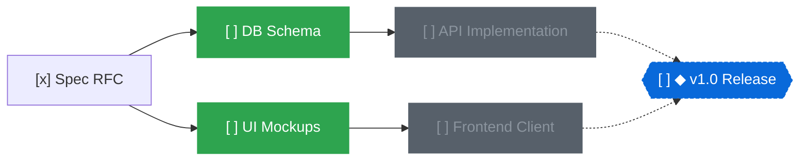

# topo

A local-first task and milestone manager modeling work as a Directed Acyclic Graph (DAG).

English | [日本語](README.ja.md)

[](https://www.rust-lang.org/)
[](https://zed.dev/)
[](#git-friendly-markdown-storage)
[](https://opensource.org/licenses/MIT)

## Overview

Flat task lists and nested folders fall apart as projects grow. Real-world tasks have prerequisite constraints: task B cannot begin until task A finishes.

Without explicit dependency tracking, discovering what can actually be worked on right now is difficult. Blocked tasks clutter your queue, while critical bottleneck chains remain obscured.

`topo` models tasks and milestones as a single unified DAG. Two relations connect nodes:

- `depends_on`: execution order (node A depends on node B = B must finish before A)
- `milestones`: set membership (a task belongs to one or more milestones)

Topological ordering identifies unblocked work automatically:



Running `topo ready` outputs only unblocked tasks (`DB Schema` and `UI Mockups`). Once `DB Schema` is marked `done`, `API Implementation` automatically becomes ready.

## Key Features

### Topological Ready Evaluation (`topo ready`)

- Filters for open tasks whose prerequisites are completely closed (`done` or `dropped`)
- Eliminates cognitive overhead by hiding blocked items
- Enforces acyclic graph invariants at write time to prevent dependency cycles

### Critical Path Analysis

- Computes the longest remaining dependency chain to any milestone
- Highlights bottleneck tasks directly impacting delivery timelines
- Displays milestone progress bars (`done`/`total`) and remaining critical steps

### Git-Friendly Markdown Storage

- Stored on disk under `.topo/nodes/<id>.md`
- YAML frontmatter for metadata, Markdown body for notes
- One file per node minimizes Git merge conflicts across branches
- Searchable, diffable, and editable alongside project code

### Three Interfaces

- **CLI**: Fast, scriptable Unix CLI with full `--json` support across all commands
- **TUI**: Keyboard-driven terminal dashboard powered by Ratatui
- **Native GUI**: High-performance canvas built with GPUI (Zed editor's GPU-accelerated UI engine). Features smooth panning, trackpad pinch zooming, drag-and-drop dependency linking, and live file synchronization

### AI Agent & Decision Model Integration

- **Agent Skill Included**: Shipped with `SKILL.md` for AI coding agents (Claude, Gemini, etc.) to decompose, schedule, and track goals
- **Atomic Batch Mutations (`topo apply`)**: Transactional JSON batch operations for all-or-nothing execution
- **Model-Assisted Graph Organization (`topo organize`)**: Connects to Jev-compatible System One models to detect missing dependencies, suggest milestone placement, and find duplicate tasks

## Quickstart

### Installation

Requires the Rust toolchain (2024 edition).

```bash
git clone https://github.com/r4ai/topological-todo.git
cd topological-todo

# Install CLI
cargo install --path crates/topo-cli

# Run Native GUI (optional)
cargo run -p topo-gui --release
```

### Basic Workflow

```bash
# Initialize workspace (.topo directory created)
topo init

# Create a milestone (prints generated node ID)
topo add "v1.0 Release" --milestone
# => a1b2c3

# Add tasks belonging to the milestone
topo add "Design spec" --in a1b2c3
# => d4e5f6

# Add follow-up task with dependency
topo add "Implement backend" --dep d4e5f6 --in a1b2c3
# => 7g8h9i

# List tasks ready to start now (only "Design spec" appears)
topo ready
# => [ ] d4e5f6  Design spec

# Update task status
topo status d4e5f6 doing
topo status d4e5f6 done

# Check ready tasks again ("Implement backend" is now unblocked)
topo ready
# => [ ] 7g8h9i  Implement backend

# Check milestone progress and critical path
topo milestones
# => [ ] a1b2c3  ◆ v1.0 Release  █████░░░░░ 1/2  1 step(s) left on critical path

# Export graph
topo graph --format mermaid
topo graph --format tree
```

## Interfaces

### CLI

Every subcommand supports `--json` for scripting and pipelines.

### TUI (`topo tui`)

Interactive dashboard in your terminal:

- `1` - `4`: Switch view (Ready, Milestones, Open, All)
- `Tab`: Cycle to next view
- `j` / `k` or Arrow keys: Navigate list
- `Space`: Cycle status (`todo` → `doing` → `done` → `todo`)
- `x`: Set status directly to `done`
- `d`: Set status directly to `dropped`
- `u`: Set status directly to `todo`
- `q` / `Esc`: Quit

### Native GUI (`topo-gui`)

Desktop interface powered by GPUI. Reflects edits from CLI or external processes live:

- Canvas Navigation:
  - `Space` + drag: Pan canvas
  - Trackpad pinch / Mouse wheel: Zoom canvas
  - `Cmd+=` / `Cmd+-` / `Cmd+0`: Zoom in / Zoom out / Actual size
  - `f`: Fit all nodes on canvas
- Node Operations:
  - `n`: New task
  - `m`: New milestone
  - `Tab`: Add follow-up task for selected node
  - `Shift+Tab`: Add prerequisite task for selected node
  - `Shift` + drag or edge-handle drag: Connect dependency link
  - `Space`: Cycle status
  - `x`: Toggle `done` status
  - `1` - `4`: Set status directly (Todo, Doing, Done, Dropped)
  - `d`: Set due date
  - `t`: Edit tags
  - `Enter` / `r` / `F2`: Edit title
  - `c`: Center canvas on selected node
  - `Backspace` / `Delete`: Delete node
  - `Cmd+Z` / `Cmd+Shift+Z`: Undo / Redo
  - `/` or `Cmd+K` / `Cmd+F`: Search by title, tag, or ID
  - `?`: Toggle keyboard shortcuts cheatsheet

## AI & Automation

### Atomic Batch Mutations (`topo apply`)

Mutate nodes and edges atomically. If any operation fails or introduces a cycle, the entire batch aborts.

```bash
topo apply --json <<'EOF'
[
  {"op": "add", "ref": "m", "title": "v2.0 Release", "kind": "milestone"},
  {"op": "add", "ref": "arch", "title": "Architecture design", "in": ["$m"]},
  {"op": "add", "ref": "core", "title": "Core engine", "depends_on": ["$arch"], "in": ["$m"]},
  {"op": "status", "id": "$arch", "status": "doing"}
]
EOF
```

### Graph Organization (`topo organize`)

Queries a local Jev-compatible decision model (`POST /v1/systemone`) to evaluate graph structure:

```bash
topo organize deps --json        # Missing prerequisites between tasks
topo organize place --json       # Milestone placement for unassigned tasks
topo organize dupes --json       # Likely duplicate tasks
topo organize prioritize --json  # Scored ranking of ready tasks
```

Pass `--apply` to automatically link proposals, safely skipping any that would introduce a cycle.

## Command Reference

| Command | Description | Common Flags |
| :--- | :--- | :--- |
| `topo init` | Initialize `.topo` workspace | |
| `topo ready` | List tasks unblocked and ready to start | `--under <id>` |
| `topo milestones` | List milestones with progress bar and critical path | |
| `topo add <title>` | Add task or milestone | `--milestone`, `--dep <id>`, `--in <ms>`, `--due <date>`, `--tag <tag>`, `--note <text>` |
| `topo link <from> <to>` | Make `<from>` depend on `<to>` | |
| `topo unlink <from> <to>` | Remove dependency of `<from>` on `<to>` | |
| `topo join <task> <ms>` | Add task to milestone membership | |
| `topo leave <task> <ms>` | Remove task from milestone | |
| `topo status <id> <st>` | Update status (`todo`, `doing`, `done`, `dropped`) | |
| `topo edit <id>` | Modify node fields | `--title`, `--due`, `--no-due`, `--tag`, `--note` |
| `topo rm <id>` | Delete node and adjacent edges | |
| `topo ls` | List nodes | `--kind <task\|milestone>`, `--status <status>`, `--under <id>`, `--all` |
| `topo show <id>` | Show node details and adjacent nodes | |
| `topo graph` | Render dependency graph | `--format [tree\|mermaid\|dot]`, `--under <id>` |
| `topo apply` | Atomically apply JSON batch operations | `[file]` or stdin |
| `topo organize <what>` | Propose or apply graph optimizations via model | `deps`, `place`, `dupes`, `kinds`, `prioritize`, `--apply`, `--under <id>` |
| `topo tui` | Launch terminal UI | |

## Project Structure

```text
.
├── crates/
│   ├── topo-core/  # DAG engine, topological sorting, Markdown persistence
│   ├── topo-cli/   # CLI binary, output renderers, Ratatui TUI
│   ├── topo-gui/   # GPUI native canvas editor
│   └── topo-jev/   # Jev System One client & organize logic
└── skills/
    └── topological-todo/ # AI coding agent instructions (SKILL.md)
```

## License

[MIT License](https://opensource.org/licenses/MIT)
