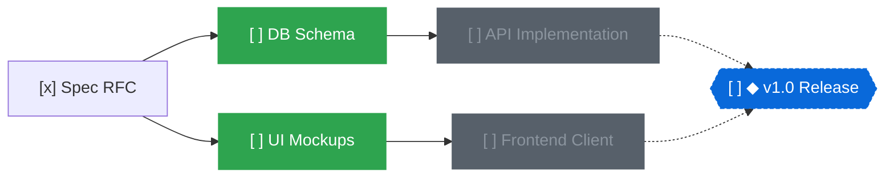

<div align="center">
  
  <h1>topo</h1>
  <p>A local-first task and milestone manager modeling work as a Directed Acyclic Graph (DAG)</p>
  <p>
    <strong>English</strong> | <a href="README.ja.md">日本語</a>
  </p>
  <p>
    <a href="https://www.rust-lang.org/"></a>
    <a href="https://zed.dev/"></a>
    
    <a href="LICENSE"></a>
  </p>
</div>

https://github.com/user-attachments/assets/3fc7a9c6-5b60-459d-b1a9-038c4c9115a7

## Why topo?

Flat task lists and nested folders fall apart as projects grow.  
Real-world work has prerequisite constraints: task B cannot begin until task A finishes.

Without explicit dependency tracking, discovering what can actually be worked on right now is difficult.  
Blocked tasks clutter your queue, while critical bottleneck chains remain obscured.

`topo` models tasks and milestones as a single unified DAG.  
Topological sorting automatically surfaces unblocked work whose prerequisites are completely satisfied.



Running `topo ready` outputs only unblocked tasks (`DB Schema` and `UI Mockups`).  
Once `DB Schema` is marked `done`, `API Implementation` automatically becomes ready.

## Key Features

- **Focus on What's Next (`topo ready`)**
  - Filters for open tasks whose prerequisites are completely satisfied
  - Eliminates cognitive overhead by hiding blocked items
  - Enforces acyclic graph invariants at write time to prevent dependency cycles
- **Critical Path Analysis**
  - Computes the longest remaining dependency chain to any milestone
  - Highlights bottleneck tasks directly impacting delivery timelines
  - Displays milestone progress bars and remaining critical steps
- **Git-Friendly Markdown Storage**
  - Stored on disk under `.topo/nodes/<id>.md`
  - YAML frontmatter for metadata, Markdown body for notes
  - One file per node minimizes Git merge conflicts across branches
- **Three High-Performance Interfaces**
  - **CLI**: Fast Unix tool with `--json` on every command and `--format ids` on listing commands for shell pipelines
  - **TUI**: Keyboard-driven terminal dashboard powered by Ratatui
  - **Native GUI**: GPU-accelerated canvas powered by GPUI (Zed editor's UI engine), featuring smooth pan and zoom, drag-and-drop linking, and live file synchronization
- **Built for AI Agents**
  - Atomic batch mutations (`topo apply`) execute multi-step graph edits transactionally
  - Bundled agent skill (`skills/topo/SKILL.md`) for tools like Claude Code and Codex
- **Seamless Cloud Sync (Optional)**
  - Serverless edge sync backed by Cloudflare Workers and D1
  - Graph sharing across devices and parallel agent workers

## Installation and Updates

### Download Prebuilt Binaries

Download precompiled CLI binaries for Linux, macOS, and Windows, or GUI installers for macOS and Windows, from [GitHub Releases](https://github.com/r4ai/topo/releases).

### Build from Source

```bash
git clone https://github.com/r4ai/topo.git
cd topo

# Install CLI
cargo install --path crates/topo-cli

# Run native GUI (optional)
cargo run -p topo-gui --release
```

### Updating

```bash
# Update from git source
git pull
cargo install --path crates/topo-cli --force
```

See the [Release Guide](docs/releasing.md) for checksum verification and package details.

## Quickstart

```bash
# 1. Initialize workspace (.topo directory created)
topo init

# 2. Create milestone
topo add "v1.0 Release" --milestone
# => a1b2c3

# 3. Add tasks with dependencies
topo add "Design spec" --in a1b2c3
# => d4e5f6

topo add "Implement backend" --dep d4e5f6 --in a1b2c3
# => 7g8h9i

# 4. List tasks ready to start now (only "Design spec" appears)
topo ready
# => [ ] d4e5f6  Design spec

# 5. Mark task as completed
topo status d4e5f6 done

# 6. Check ready tasks again ("Implement backend" is now unblocked)
topo ready
# => [ ] 7g8h9i  Implement backend

# 7. Check milestone progress and critical path
topo milestones
# => [ ] a1b2c3  ◆ v1.0 Release  █████░░░░░ 1/2  1 step(s) left on critical path

# 8. Render dependency graph
topo graph --format mermaid
```

## Tech Stack

Engineered for zero latency and minimal resource overhead:

| Component | Technology | Rationale |
| :--- | :--- | :--- |
| **Core / CLI / GUI** | Rust | Strict memory safety, instant startup times, and minimal memory footprint |
| **Native GUI** | GPUI | GPU-accelerated canvas engine from the Zed editor, keeping pan and zoom smooth on graphs of hundreds of nodes |
| **TUI** | Ratatui | Efficient, responsive keyboard-driven terminal dashboard |
| **Cloud Backend** | Cloudflare Workers & D1 | Low-latency serverless edge synchronization with zero maintenance overhead |

## Documentation

- [Usage Guide & Command Reference](docs/usage.md): Full flag listings, pipeline patterns, GUI/TUI controls, and cloud workflow
- [Developer Guide](docs/development.md): Crate architecture, local development, tests, and benchmarks
- [Cloud Architecture & Setup](docs/cloud/README.md): Cloudflare Workers and D1 backend specification
- [Release Guide](docs/releasing.md): Tagging, release automation, and binary verification

## License

[MIT License](LICENSE)
