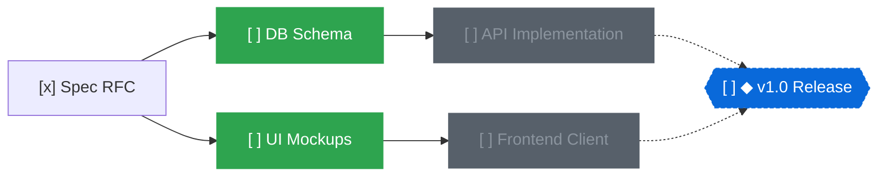

# topo

A local-first task and milestone manager modeling work as a Directed Acyclic Graph (DAG).

English | [日本語](README.ja.md)

[](https://www.rust-lang.org/)
[](https://zed.dev/)
[](#git-friendly-markdown-storage)
[](https://opensource.org/licenses/MIT)

https://github.com/user-attachments/assets/3fc7a9c6-5b60-459d-b1a9-038c4c9115a7

## Overview

Flat task lists and nested folders fall apart as projects grow. Real-world tasks have prerequisite constraints: task B cannot begin until task A finishes.

Without explicit dependency tracking, discovering what can actually be worked on right now is difficult. Blocked tasks clutter your queue, while critical bottleneck chains remain obscured.

`topo` models tasks and milestones as a single unified DAG. Two relations connect nodes:

- `depends_on`: execution order (node A depends on node B = B must finish before A)
- `milestones`: set membership (a task belongs to one or more milestones)

Topological ordering identifies unblocked work automatically:



Running `topo ready` outputs only unblocked tasks (`DB Schema` and `UI Mockups`). Once `DB Schema` is marked `done`, `API Implementation` automatically becomes ready.

## Key Features

### Topological Ready Evaluation (`topo ready`)

- Filters for open tasks whose prerequisites are completely closed (`done` or `dropped`)
- Eliminates cognitive overhead by hiding blocked items
- Enforces acyclic graph invariants at write time to prevent dependency cycles

### Critical Path Analysis

- Computes the longest remaining dependency chain to any milestone
- Highlights bottleneck tasks directly impacting delivery timelines
- Displays milestone progress bars (`done`/`total`) and remaining critical steps

### Git-Friendly Markdown Storage

- Stored on disk under `.topo/nodes/<id>.md`
- YAML frontmatter for metadata, Markdown body for notes
- One file per node minimizes Git merge conflicts across branches
- Searchable, diffable, and editable alongside project code

### Three Interfaces

- **CLI**: Fast, scriptable Unix CLI with full `--json` support across all commands
- **TUI**: Keyboard-driven terminal dashboard powered by Ratatui
- **Native GUI**: High-performance canvas built with GPUI (Zed editor's GPU-accelerated UI engine). Features smooth panning, trackpad pinch zooming, drag-and-drop dependency linking, and live file synchronization

### AI Agent & Decision Model Integration

- **Agent Skill Included**: Shipped with `SKILL.md` for AI coding agents (Claude, Gemini, etc.) to decompose, schedule, and track goals
- **Atomic Batch Mutations (`topo apply`)**: Transactional JSON batch operations for all-or-nothing execution
- **Model-Assisted Graph Organization (`topo organize`)**: Connects to Jev-compatible System One models to detect missing dependencies, suggest milestone placement, and find duplicate tasks

## Quickstart

### Installation

Download prebuilt CLI binaries for Linux, Windows, and macOS, or macOS GUI binaries
from [GitHub Releases](https://github.com/r4ai/topo/releases). See
[installation, verification, and release workflow](docs/releasing.md) for details.

To build from source, use the Rust toolchain pinned in `rust-toolchain.toml` (2024 edition).

```bash
git clone https://github.com/r4ai/topo.git
cd topo

# Install CLI
cargo install --path crates/topo-cli

# Run Native GUI (optional)
cargo run -p topo-gui --release
```

### Basic Workflow

```bash
# Initialize workspace (.topo directory created)
topo init

# Create a milestone (prints generated node ID)
topo add "v1.0 Release" --milestone
# => a1b2c3

# Add tasks belonging to the milestone
topo add "Design spec" --in a1b2c3
# => d4e5f6

# Add follow-up task with dependency
topo add "Implement backend" --dep d4e5f6 --in a1b2c3
# => 7g8h9i

# List tasks ready to start now (only "Design spec" appears)
topo ready
# => [ ] d4e5f6  Design spec

# Update task status
topo status d4e5f6 doing
topo status d4e5f6 done

# Check ready tasks again ("Implement backend" is now unblocked)
topo ready
# => [ ] 7g8h9i  Implement backend

# Check milestone progress and critical path
topo milestones
# => [ ] a1b2c3  ◆ v1.0 Release  █████░░░░░ 1/2  1 step(s) left on critical path

# Export graph
topo graph --format mermaid
topo graph --format tree
```

## Interfaces

### CLI

Commands support `--json` for structured output. `ls`, `ready`, `milestones`, and graph traversal commands also accept `--format text|ids|tsv|jsonl`. Listings keep text output when redirected; traversal commands default to IDs.

Pass `-` as the first argument to `status`, `edit`, `rm`, `join`, `leave`, `link`, or `unlink` to read whitespace-separated IDs from stdin. All IDs and changes are validated before saving; empty input does nothing. `topo ls -` filters incoming IDs with the usual listing flags.

```bash
topo ready --format ids | topo status - doing
topo ls --tag gui --format ids | topo ls - --due-before 2026-10-31 --format ids | topo join - a1b2c3
topo deps a1b2c3 --transitive | topo ls - --blocked --format tsv
topo ready --format jsonl | jq -r 'select(.status == "todo") | .id'
```

### TUI (`topo tui`)

Interactive dashboard in your terminal:

- `1` - `4`: Switch view (Ready, Milestones, Open, All)
- `Tab`: Cycle to next view
- `j` / `k` or Arrow keys: Navigate list
- `Space`: Cycle status (`todo` → `doing` → `done` → `todo`)
- `x`: Set status directly to `done`
- `d`: Set status directly to `dropped`
- `u`: Set status directly to `todo`
- `q` / `Esc`: Quit

### Native GUI (`topo-gui`)

Desktop interface powered by GPUI. Reflects edits from CLI or external processes live:

- Canvas Navigation:
  - Drag (background, card, or middle button) / trackpad scroll: Pan canvas
  - Mouse wheel / pinch / `Cmd` + scroll: Zoom canvas around pointer
  - Two-finger double-tap: Toggle between fit and actual size
  - `Cmd+=` / `Cmd+-` / `Cmd+0`: Zoom in / Zoom out / Actual size
  - `f`: Fit all nodes on canvas
- Inspector (right panel):
  - Drag its left border: Resize the panel (clamped so the canvas keeps its share)
  - The chosen width is remembered across restarts in the user config, never in the workspace
  - Titles wrap up to three lines; every overflowing one-line value ends in `…`
  - The title and the DETAILS rows are edited in place: click one or press its key (`Enter` title, `p` priority, `a` assignee, `d` due date, `t` tags). `Enter` saves, `Esc` or a click elsewhere cancels, and input that cannot be saved keeps the field open with the reason under it
  - The field completes like a code editor: a floating list (it moves nothing below) offers the priorities, the assignees and tags the workspace already uses, and due dates that follow what you type (`3` → `+3d`, `+3w`, `+3m`, the 3rd; `fr` → `friday`). The first match is highlighted, completed faintly in the field, and taken by `Enter`; `↓` / `↑` or a click choose another. `Esc` closes the list to save the typed text as it is, and a second `Esc` cancels
  - Tags are edited as chips: a space or comma finishes a tag as typed, `Backspace` in the empty field removes the last one, `×` removes any
  - `Tab` / `Shift+Tab` save the field and open the next / previous one (title → priority → assignee → due → tags → pull request)
  - NOTES are written in the panel, in a cloud workspace too: click them or press `e`, `Enter` breaks the line, `Cmd+Enter` saves. Leaving the editor (a click elsewhere, another selection) also saves; only `Esc` discards
  - Created / updated / completed times are shown read-only in the local time zone (`Unknown` for nodes older than the timestamps)
  - PULL REQUESTS lists the linked pull requests: `g` or `+` links one (a URL or `owner/repo#123`), a click opens it in the browser, `×` unlinks it
- Node Operations:
  - Click: Select node (`Cmd` / `Ctrl` + click for multi-selection to batch change status or delete)
  - `n`: New task
  - `m`: New milestone
  - `Tab`: Add follow-up task for selected node
  - `Shift+Tab`: Add prerequisite task for selected node
  - `Shift` + drag or edge-handle drag: Connect dependency link (a task dropped on a milestone joins it; dropped on empty canvas, it creates a follow-up task)
  - `l` / `Shift+l`: Pick an existing node as a prerequisite / as a dependent
  - `i`: Add the task to a milestone (on a milestone: add a member task)
  - `Space`: Cycle status
  - `x`: Toggle `done` status
  - `1` - `4`: Set status directly (Todo, Doing, Done, Dropped)
  - `p` / `a` / `d` / `t`: Edit priority / assignee / due date / tags in the inspector
  - `g`: Link a pull request
  - `Shift+p`: Dim nodes below a priority (urgent → high and up → medium and up → any priority → all)
  - `Enter` / `r` / `F2` / double-click: Edit the title in the inspector
  - `e`: Edit the notes in the inspector
  - `o`: Open the node's Markdown file (notes) in the default editor (a cloud workspace has no file, so it edits in the inspector)
  - Arrow keys: Move the selection along dependencies (left / right) or within a column (up / down)
  - `c`: Center canvas on selected node (fits all when multiple selected)
  - `Backspace` / `Delete`: Delete node
  - `Cmd+A`: Select every node (those the priority filter leaves undimmed)
  - `Cmd+C` / `Cmd+X` / `Cmd+V`: Copy / cut / paste the selected nodes. A paste adds copies as new `todo` nodes with fresh ids, keeping the links between them; assignee, pull requests and times are not copied. Other applications receive a Markdown list
  - `Cmd+Z` / `Cmd+Shift+Z`: Undo / Redo
  - While a text field (prompt, search, or an inspector row) has the focus, `Cmd+A/C/X/V/Z/Shift+Z` act on its text instead, and canvas keys are typed as text. The Edit menu follows the same rule and disables what cannot run
  - `/` or `Cmd+K` / `Cmd+F`: Search by title, tag, or ID
  - `?`: Toggle keyboard shortcuts cheatsheet

#### Headless screenshots

Build with the `screenshot` feature to render the window to a PNG offscreen, without a display or the OS screen-recording permission:

```bash
cargo run -p topo-gui --features screenshot -- \
  --screenshot qa.png --width 1360 --height 860 --select <id>
```

`--select` accepts one id or a comma-separated list (an unknown id is an error), `--inspector-width` sets the panel width (otherwise derived from the window, ignoring the saved preference), `--edit <field>` with `--type <text>` opens the title or a DETAILS row of the selected node for editing, `--edit-notes` opens its notes, `--search <query>` opens the search prompt, and `--help-overlay` opens the shortcuts sheet. Sizes are whole points; a size larger than the display is an error. `topo-gui --help` lists every option. This is meant for visual QA and documentation.

## AI & Automation

### Atomic Batch Mutations (`topo apply`)

Mutate nodes and edges atomically. If any operation fails or introduces a cycle, the entire batch aborts.

```bash
topo apply --json <<'EOF'
[
  {"op": "add", "ref": "m", "title": "v2.0 Release", "kind": "milestone"},
  {"op": "add", "ref": "arch", "title": "Architecture design", "in": ["$m"]},
  {"op": "add", "ref": "core", "title": "Core engine", "depends_on": ["$arch"], "in": ["$m"]},
  {"op": "status", "id": "$arch", "status": "doing"}
]
EOF
```

### Graph Organization (`topo organize`)

Queries a local Jev-compatible decision model (`POST /v1/systemone`) to evaluate graph structure:

```bash
topo organize deps --json        # Missing prerequisites between tasks
topo organize place --json       # Milestone placement for unassigned tasks
topo organize dupes --json       # Likely duplicate tasks
topo organize prioritize --json  # Scored ranking of ready tasks
```

Pass `--apply` to automatically link proposals, safely skipping any that would introduce a cycle.

## Cloud Workspaces

A workspace can live on a server instead of in `.topo/nodes`, so that several devices and parallel AI agents share one graph. The server is a Cloudflare Worker with a D1 database; see [docs/cloud](docs/cloud/README.md) for the design and how to deploy it.

```bash
# Sign in with GitHub (device flow) and move the local workspace to the server
topo login --url https://topo.example.com
topo cloud push --url https://topo.example.com

# Every command now reads and writes the server; the TUI and GUI poll it
topo ready

# Give an agent its own token, restricted to this workspace
topo token create --name agent-1 --workspace <workspace-id> --expires 90d

# An agent sets TOPO_TOKEN and TOPO_CLOUD_URL to the trusted server, then claims a task
topo status <id> doing --if todo --assign "$TOPO_AGENT"
```

The link is a `[cloud]` table in `.topo/config.toml`, which holds no secret and can be committed. `topo cloud pull` writes the nodes back to Markdown files and removes the link.

## Command Reference

| Command | Description | Common Flags |
| :--- | :--- | :--- |
| `topo init` | Initialize `.topo` workspace | |
| `topo ready` | List tasks unblocked and ready to start | `--under <id>`, `--sort priority`, `--format <text\|ids\|tsv\|jsonl>` |
| `topo milestones` | List milestones with progress bar and critical path | `--format <text\|ids\|tsv\|jsonl>` |
| `topo add <title>` | Add task or milestone | `--milestone`, `--dep <id>`, `--in <ms>`, `--due <date>`, `--tag <tag>`, `--priority <low\|medium\|high\|urgent>`, `--assignee <name>`, `--pr <url\|owner/repo#N>`, `--note <text>` |
| `topo link <from> <to>` | Make `<from>` depend on `<to>` | |
| `topo unlink <from> <to>` | Remove dependency of `<from>` on `<to>` | |
| `topo join <task> <ms>` | Add task to milestone membership | |
| `topo leave <task> <ms>` | Remove task from milestone | |
| `topo status <id> <st>` | Update status (`todo`, `doing`, `done`, `dropped`) | `--if <st>` (fail unless the node has this status), `--assign <name>` (set the assignee in the same atomic write) |
| `topo edit <id>` | Modify node fields | `--title`, `--due`, `--no-due`, `--tag`, `--priority`, `--no-priority`, `--assignee`, `--no-assignee`, `--pr`, `--unpr`, `--note` |
| `topo rm <id>` | Delete node and adjacent edges | |
| `topo ls [-]` | List or filter incoming nodes | `--kind`, `--status`, `--under`, `--all`, `--tag`, `--in`, `--due-before`, `--due-after`, `--no-due`, `--ready`, `--blocked`, `--title`, `--priority`, `--assignee`, `--unassigned`, `--sort priority`, `--format` |
| `topo show <id>` | Show node details (priority, assignee, pull requests, created/updated/completed times) and adjacent nodes | |
| `topo deps <id>` | List prerequisites, including milestone members | `--transitive`, `--format`, `--json` |
| `topo dependents <id>` | List nodes depending on a node | `--transitive` (also follows membership), `--format`, `--json` |
| `topo members <ms>` | List a milestone's member tasks | `--format`, `--json` |
| `topo critical-path <id>` | List the longest remaining chain in execution order | `--format`, `--json` |
| `topo graph` | Render dependency graph | `--format [tree\|mermaid\|dot]`, `--under <id>` |
| `topo apply` | Atomically apply JSON batch operations | `[file]` or stdin |
| `topo organize <what>` | Propose or apply graph optimizations via model | `deps`, `place`, `dupes`, `kinds`, `prioritize`, `--apply`, `--under <id>` |
| `topo tui` | Launch terminal UI | |
| `topo login` / `topo logout` | Sign in to a cloud server with GitHub; revoke and forget the token | `--url <url>`, `--name <token name>` |
| `topo token <create\|ls\|revoke>` | Manage tokens for clients and agents | `--name`, `--workspace <id>`, `--expires <90d>` |
| `topo cloud <push\|pull\|link\|ls>` | Move the workspace to or from a server, link to an existing one, list workspaces | `--url <url>`, `--name <name>` |
| `topo cloud <members\|invite\|remove>` | List, add, and remove members of the linked workspace | `--role <owner\|editor\|viewer>` |
| `topo cloud log` | Show who changed the linked workspace | `--after <version>` |

## Project Structure

```text
.
├── crates/
│   ├── topo-core/  # DAG engine, topological sorting, Markdown persistence
│   ├── topo-cli/   # CLI binary, output renderers, Ratatui TUI
│   ├── topo-gui/   # GPUI native canvas editor
│   ├── topo-jev/   # Jev System One client & organize logic
│   ├── topo-cloud/ # Client of the cloud API: sign-in, tokens, cloud-backed workspace
│   └── topo-server/ # The cloud API (Cloudflare Workers + D1)
├── docs/
│   └── cloud/      # Design of the cloud edition
└── skills/
    └── topo/ # AI coding agent instructions (SKILL.md)
```

## License

[MIT License](https://opensource.org/licenses/MIT)
