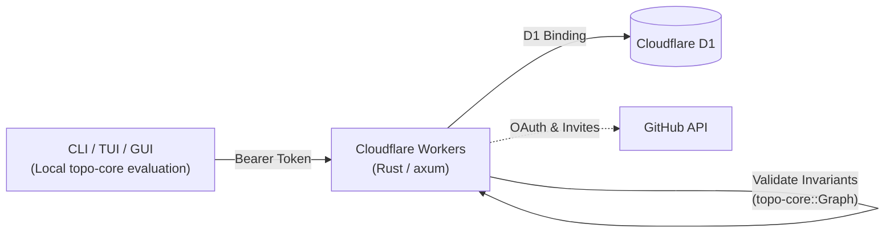

# Cloud Architecture

The cloud edition moves a workspace's source of truth to a remote server, enabling multiple devices and parallel AI agents to collaborate on a single shared graph. Local Markdown files serve as import and export formats while connected.

## Design Principles

- **Server-Authoritative State**: The database holds the canonical graph; linked workspaces read and write through the network
- **Thin Server Architecture**: The server only authenticates, serializes writes, and stores node state. All DAG evaluation (`ready`, critical paths, filtering) runs locally in clients linking `topo-core`
- **Unified Write Path**: Every edit is an atomic batch sent to `apply`; a whole-graph import (`PUT /graph`) goes through the same validated write path. The server validates invariants and cycle-freedom using `topo-core::Graph` before committing
- **Role-Based Membership**: Users authenticate via GitHub OAuth. Workspaces support granular member roles (`owner`, `editor`, `viewer`)

## Architecture Diagram

## Technology Stack

| Layer | Choice | Rationale |
| :--- | :--- | :--- |
| **Runtime** | Cloudflare Workers (`workers-rs`) | Serverless edge execution, scales to zero, shared Rust toolchain |
| **Web Framework** | axum | Idiomatic, strongly-typed asynchronous HTTP routing |
| **Database** | Cloudflare D1 | Serverless SQLite with transactional batch execution |
| **Validation Engine** | `topo-core::Graph` | Reuses graph invariant and cycle checks identically across client and server |
| **Authentication** | GitHub Device Flow | Native CLI/agent friendly login without browser session cookies |
| **Synchronization** | HTTP polling with `ETag` | Lightweight change detection (`304 Not Modified`) without WebSocket overhead |
| **Query Builder** | sea-query | Type-safe parameterized SQL preventing injection vulnerabilities |
| **API Docs** | utoipa & Scalar | OpenAPI specifications generated directly from handler types |

## Crates

| Crate | Role |
| :--- | :--- |
| `topo-core` | DAG model, graph mutations (`ops`), and API wire types (`wire`). Compiles to WebAssembly |
| `topo-cloud` | Client library for authentication, credentials store, token management, and sync transport |
| `topo-server` | Cloudflare Workers API implementation |

## Detailed Documentation

- [database.md](database.md): Database schema, relational constraints, and write flow
- [api.md](api.md): Endpoints, token authentication, concurrency control, and errors
- [deployment.md](deployment.md): Worker configuration, environment secrets, and deployment steps
