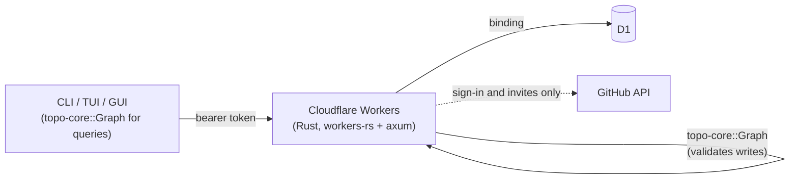

# Cloud edition

The cloud edition moves a workspace's source of truth to a server, so that
several devices and several AI agents working in parallel share one graph. The
local Markdown files remain an import and export format, not the live store.

## Model

Four decisions define the cloud edition:

- **Server-authoritative**: the database holds the canonical state. A workspace
  linked to the cloud has no local nodes, and its commands need the network.
- **Thin server**: the server authenticates, serializes writes, and stores
  nodes. It answers no graph queries. Every client is written in Rust and links
  `topo-core`, so a client downloads the whole workspace and evaluates `ready`,
  the critical path, filters, and rendering locally, exactly as the local
  edition does.
- **One write path**: every mutation is a batch of operations sent to `apply`.
  The server loads the workspace into `topo-core::Graph`, applies the batch,
  and stores the difference. Cycle detection and the other invariants therefore
  match the local edition exactly.
- **Multi-user**: anyone with a GitHub account can sign in. A workspace has
  members with roles, and every request is authorized against membership.

## Architecture



## Technology stack

| Layer | Choice | Rationale |
| :--- | :--- | :--- |
| Runtime | Cloudflare Workers (Rust, `workers-rs`) | Scales to zero, no servers to operate, shares the Rust toolchain |
| Web framework | axum | Matches the existing Rust style; `workers-rs` supports it |
| Database | D1 | SQLite reached through a Workers binding, with transactional batches and no extra vendor |
| Graph engine | `topo-core::Graph` | Reuses validation verbatim |
| Auth | GitHub device flow, then tokens issued by the server | The clients are native programs and agents; no browser session or JWT verification is needed |
| Sync | Polling with `ETag` | A few seconds of delay is acceptable, so no WebSocket or Durable Object is needed |
| SQL | sea-query | Statements are built as values and bound as parameters, so request data never becomes SQL text |
| API reference | utoipa, served with Scalar | The OpenAPI document is generated from the handlers and the types they use |

## Structure

- [database.md](database.md): schema, integrity rules, the write flow.
- [api.md](api.md): authentication, endpoints, concurrency, errors.
- [deployment.md](deployment.md): Workers configuration, environments, limits.

## Crates

| Crate | Role |
| :--- | :--- |
| `topo-core` | Graph, operations (`ops`), and the bodies of the API (`wire`). Compiles to WebAssembly without its `fs` feature. |
| `topo-server` | The API: an axum router over a `Db` and a `GitHub` trait. On Workers these are D1 and `fetch`; on the host, for tests, SQLite and a fake. |
| `topo-cloud` | The blocking client: configuration, credentials, GitHub device flow, and `open`, which returns a file- or cloud-backed `Workspace`. |

## Client

A workspace is linked to the cloud by a `[cloud]` table in the existing
`.topo/config.toml`:

```toml
[cloud]
url = "https://api.example.com"
workspace = "k3v9x0q2m1ab"
```

When the table is present, `topo_cloud::open` loads the graph from the server
instead of `.topo/nodes`. The clients are otherwise unchanged: they mutate
`Workspace::graph` and call `save()`, which for a linked workspace sends the
difference as operations (`ops::diff`). The server applies them to its current
graph, so changes by other writers since the last read are merged rather than
overwritten. Each CLI command is one `GET` of the graph, a local computation,
and at most one `POST`. The TUI and GUI ask the server every five seconds
whether the version changed, in place of watching files.

A node's id is chosen by the client that adds it, as in the local edition.

The token comes from the `TOPO_TOKEN` environment variable (for agents and CI)
or from `credentials.toml` in `$XDG_CONFIG_HOME/topo`, `%APPDATA%\topo`, or
`~/.config/topo`, which `topo login` writes with owner-only permissions.

| Command | Effect |
| :--- | :--- |
| `topo login` / `topo logout` | Sign in with GitHub and store a token; revoke and forget it |
| `topo token create` / `ls` / `revoke` | Manage tokens, for example one per agent, optionally restricted to a workspace |
| `topo cloud push` | Create a cloud workspace from the local `.topo/nodes` and link this directory |
| `topo cloud pull` | Write the cloud workspace to `.topo/nodes` and unlink this directory |
| `topo cloud link` | Link this directory to an existing cloud workspace |
| `topo cloud ls` / `members` / `invite` / `remove` | List workspaces; list, add, and remove members |
| `topo cloud log` | Show who changed the workspace |
| `topo status ID doing --if todo` | Claim a task: the server rejects the write unless the status still is `todo` |

| Variable | Meaning |
| :--- | :--- |
| `TOPO_TOKEN` | Token to send, instead of the stored one; requires matching `TOPO_CLOUD_URL` |
| `TOPO_CLOUD_URL` | Trusted server bound to `TOPO_TOKEN`; also the default for commands accepting `--url` |
| `TOPO_AGENT` | Label recorded with every write, to tell apart agents that share a token |

Sign-in requires `--url` or `TOPO_CLOUD_URL`. Requests use HTTPS except for
loopback development and never follow redirects. Ordinary linked-workspace
commands still use the stored credential for that server when `TOPO_TOKEN` is absent.

Model-assisted organization (`topo-jev`) stays in the client. It reads the
downloaded graph, calls the model with the user's own configuration, and sends
accepted proposals through `save()`.

## Known limits

- **The GUI saves on its main thread.** A save waits for the server, up to a
  15 second timeout. Polling runs in the background.
- **`topo cloud push` leaves the Markdown files in place.** They are no longer
  read while the directory is linked; `topo cloud pull` rewrites them.
- **A stale client can fail a save.** A change computed from an old graph may
  no longer apply, for example removing an edge another writer already removed.
  The save fails with the server's message and the next poll brings the client
  up to date.
