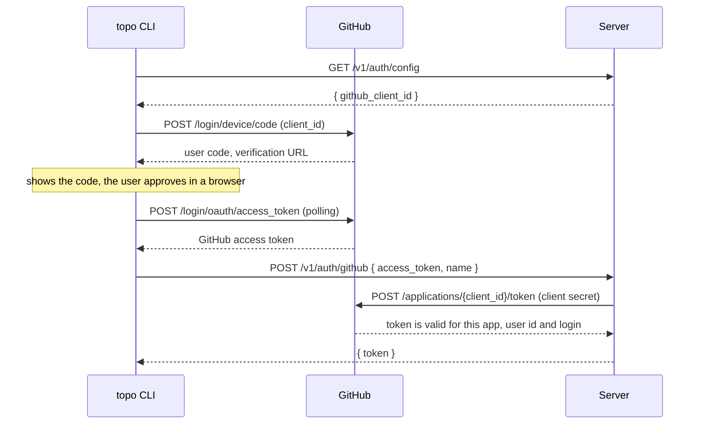

# API

A JSON HTTP API under `/v1`. The server stores and validates; it answers no
graph queries. A client downloads the graph, evaluates everything with
`topo-core`, and sends mutations as operations.

This page explains the design. The exact shapes are in the OpenAPI document
the server generates from its handlers: `/openapi.json`, rendered by Scalar at
`/docs`.

## Authentication

Every request carries `Authorization: Bearer <token>`, except the two sign-in
routes (`GET /v1/auth/config` and `POST /v1/auth/github`) and the API
reference (`/openapi.json` and `/docs`). A token is a random secret issued by the server (`topo_` followed by
32 random bytes in hex). The server stores only its SHA-256 hash and finds the
user by looking the hash up in `tokens`.

### Sign-in

`topo login` uses GitHub's OAuth device flow, which needs no browser session
with the server and no redirect URI:



The server checks the GitHub token with the "check a token" endpoint,
authenticated by the OAuth app's client secret. That endpoint accepts only
tokens issued to this app, so a GitHub token obtained by another application
cannot be used to sign in. The device flow requests no scopes. The server
upserts `users` by GitHub id, issues a token, and keeps nothing from GitHub;
the client discards the GitHub token.

### Tokens

```text
GET    /v1/auth/config         the client id of the GitHub OAuth app
POST   /v1/auth/github         exchange a GitHub token for a token
GET    /v1/user                the caller
GET    /v1/tokens              list the caller's tokens (never the secrets)
POST   /v1/tokens              create { name, workspace_id?, expires_in? }
DELETE /v1/tokens/{id}         revoke
```

`POST /v1/tokens` is how an agent or CI job gets a credential. The secret is
returned once. A token with `workspace_id` can only read and write the nodes
of that workspace: it cannot manage tokens, workspaces, or members, which
bounds what a leaked agent credential can do. It can revoke itself.

### Agents without a user present

The device flow needs a person and a browser, so an agent that runs in a cloud
sandbox or a CI job never signs in. A person creates a token for it once and
registers the secret with the platform that runs the agent:

1. `topo token create --name <environment> --workspace <wid>` prints the
   secret (add `--expires 90d` where the agent can read it).
2. The secret goes into the platform's secret store, exposed to the agent as
   the `TOPO_TOKEN` environment variable. Set `TOPO_CLOUD_URL` alongside it to
   the trusted server URL, outside the checked-out repository. The client refuses
   to send the token if the workspace selects a different URL.
3. The repository the agent checks out already contains `.topo/config.toml`
   with the `[cloud]` table, which holds no secret. `topo` finds the workspace
   from the file and the credential from the environment.

This is done once per environment, not per task. Platforms that start tasks
from a chat or an integration offer no way to pass a fresh credential to each
task and issue no identity token the server could verify, so a registered
secret is the only option there.

Some platforms never show the agent the secret. Codex cloud's network secrets
put a placeholder in `TOPO_TOKEN` and have the outbound proxy substitute the
real value in HTTPS requests to the allowed domain. A token registered that way
cannot be read or leaked by the agent, which makes a token without expiry
acceptable and removes rotation. Two rules keep the client compatible:

- The client sends `TOPO_TOKEN` verbatim in the `Authorization` header and
  never inspects, validates, or hashes it.
- The client honors the proxy environment variables and the system certificate
  store, because such a proxy terminates TLS.

Sign-in requires an explicit `--url` or `TOPO_CLOUD_URL`; a workspace link
cannot select where the GitHub access token is exchanged. Cloud requests require
HTTPS, except for loopback development servers, and do not follow redirects.
`GET /v1/workspaces/{wid}/members` includes each member's stable `user_id`.
Use `topo cloud remove --user-id <id>` to revoke a renamed or deleted account;
removal by login resolves the account's current GitHub identity.

Where the agent can read the secret (a plain environment variable), the token
gets an expiry instead.

Every write records the id and name of the token that made it. Agents that
have their own tokens are told apart in the change log. Tasks that share one
environment's token set `TOPO_AGENT`, which the client sends as the
`Topo-Agent` header and the server records with the change. The label is
self-declared, so it distinguishes cooperating agents; it does not
authenticate them.

`TOPO_AGENT` labels the writer; it does not automatically fill the node's
`assignee`. Claim with `topo status <id> doing --if todo --assign "$TOPO_AGENT"`,
reassign with `topo edit <id> --assignee <name>`, and clear the assignment with
`--no-assignee`. `topo ready --unassigned` finds unclaimed ready tasks and
`topo ls --pr owner/repo#12 --assignee <name>` finds an agent's linked work.
These filters run on the fetched snapshot and require no additional API routes.

### Authorization

The `workspace_members` row for the caller decides access: `owner` and `editor`
may write nodes, `viewer` may only read, and only `owner` may rename or delete
the workspace and manage members. A caller who is not a member receives
`not_found`, the same as for a workspace that does not exist.

## Workspaces and members

```text
POST   /v1/workspaces                           create { name } (caller becomes owner)
GET    /v1/workspaces                           list workspaces the caller belongs to
PATCH  /v1/workspaces/{wid}                     rename { name }
DELETE /v1/workspaces/{wid}                     delete
GET    /v1/workspaces/{wid}/members             list members
PUT    /v1/workspaces/{wid}/members/{login}     add or change { role }
DELETE /v1/workspaces/{wid}/members/{login}     remove
```

Members are addressed by GitHub login. `PUT` resolves the login to a GitHub id
through the GitHub API and stores the membership under the id, so a member can
be added before their first sign-in and a later rename does not move access to
someone else. A workspace keeps at least one owner: removing or demoting the
last one fails with `conflict`.

## Graph

```text
GET    /v1/workspaces/{wid}/graph               every node, with the version
PUT    /v1/workspaces/{wid}/graph               replace every node (import)
POST   /v1/workspaces/{wid}/apply               atomic batch of operations
GET    /v1/workspaces/{wid}/changes?after={v}   change log, for audit
```

### Reading

`GET .../graph` returns the whole workspace:

```json
{
  "version": 13,
  "nodes": [
    { "id": "k2x9ab", "kind": "task", "title": "Core engine", "status": "doing",
      "due": "2026-10-31", "tags": ["core"], "priority": "high", "assignee": "agent-3",
      "prs": ["https://github.com/r4ai/topo/pull/12"],
      "created_at": "2026-10-01T09:00:00Z", "updated_at": "2026-10-03T12:30:00Z",
      "depends_on": ["m4p0zz"], "milestones": ["a1b2c3"], "body": "notes" }
  ]
}
```

A field without a value is absent: `due`, `priority` (`low`, `medium`, `high`,
or `urgent`), `assignee`, the three times, and the empty lists. `completed_at`
is present only while the status is `done`.

The response carries `ETag: "13"`. A client that polls sends `If-None-Match`
and receives `304 Not Modified` while the version is unchanged; that case
reads one row. There is no incremental sync: a workspace is tens of kilobytes,
and replacing the client's graph is simpler than patching it.

`ready`, dependency closures, the critical path, milestone progress, the
`topo ls` filters, and the Mermaid, DOT, and tree renderings are all computed
by the client from this response.

### Writing

`POST .../apply` is the only way to change nodes:

```http
POST /v1/workspaces/k3v9x0q2m1ab/apply
Idempotency-Key: 7c0e6f2a-5d0b-4c57-9a55-2f6f1f1f7a10
Topo-Agent: agent-3

{
  "ops": [
    { "op": "add", "ref": "m", "title": "v2.0 Release", "kind": "milestone" },
    { "op": "add", "ref": "core", "title": "Core engine", "depends_on": ["$m"], "in": ["$m"] },
    { "op": "status", "id": "$core", "status": "doing" }
  ]
}
```

It returns `{ "version": 14, "created": { "m": "...", "core": "..." } }`. The
operation shapes are those of `topo apply`, with one difference: ids are exact.
The client resolves prefixes against the graph it downloaded, because a prefix
resolved on the server could match a node created in the meantime.

If any operation fails, the whole batch is rejected and the version is
unchanged.

These details of the operations matter to clients:

- **`add` may carry an `id`.** Clients choose ids as the local edition does;
  the server generates one only when it is absent, and rejects an id that is
  taken or is not 1 to 32 characters of `0-9a-z`.
- **`status` may carry `if_status`.** The operation fails with `conflict`
  unless the node has that status when the server applies it. An agent claims a
  task with `{"op": "status", "id": "...", "status": "doing", "if_status":
  "todo"}`; of several agents that do, one succeeds.
- **`edit` distinguishes an absent `due` from `"due": null`.** The first leaves
  the date unchanged and the second clears it. `priority` and `assignee` work
  the same way. `prs` replaces the list of pull requests, and `[]` clears it.
- **`assignee` and `prs` are stored in canonical form.** An assignee is
  trimmed. A pull request is an `http(s)` URL or `owner/repo#123`, stored as
  the URL of the pull request, so two links to one pull request are equal; a
  list that names one twice is rejected. The change log records the canonical
  values.
- **A batch is how an agent claims a task with its name.**
  `[{"op": "status", "id": "...", "status": "doing", "if_status": "todo"},
  {"op": "edit", "id": "...", "assignee": "agent-3"}]` assigns the task only
  if the status change holds, so the loser of a race overwrites nothing.

- **`Idempotency-Key`** is required. A client generates one per command and
  reuses it when it retries after a timeout. The server returns the original
  result instead of applying the batch twice.
- **`If-Match`** is optional. Without it the operations apply to the current
  graph, whatever its version, which is what a CLI command or an agent wants:
  two writers that touch different nodes both succeed. With it the write fails
  with `precondition_failed` unless the version matches, for a client that must
  not write over a change it has not seen.

`PUT .../graph` takes `{ "nodes": [...] }`, validates it with
`Graph::from_nodes`, and replaces the workspace's nodes, keeping their ids. It
takes the same headers and is recorded in the change log as the operations
that lead from the old nodes to the new ones. `topo cloud push` uses it to
import a local workspace. An import is the one write that does not record
times: the nodes are stored with the `created_at`, `updated_at`, and
`completed_at` they carry, so a workspace keeps its history when it moves to
the server and back. Unlike `apply`, it does not rewrite `assignee` and `prs`
either; values that are not canonical are rejected.

### Timestamps

The server records the three times of a node, in UTC to the second, and no
operation carries them:

- `created_at` when an `add` creates the node;
- `updated_at` whenever a write changes any of its fields, including its
  edges;
- `completed_at` when its status becomes `done`. It is kept while the node
  stays `done` and removed when the node is reopened or dropped.

A node that a write leaves as it was keeps its times, so an edit to the value
a field already has, or a retry with a recorded `Idempotency-Key`, moves
nothing. A node stored before the times existed has none until it changes, and
then gets `updated_at` only: a time that is not known is never made up.

### Change log

`GET .../changes?after={version}` returns the recorded writes in order, each
with its version, user, token name, `Topo-Agent` label, time, and operations
with ids resolved. Clients do not
replay it to sync; it answers who changed what, which matters when several
agents write to one workspace.

## Errors

Errors return `{"error": {"code": string, "message": string}}`.

| Status | Code | Meaning |
| :--- | :--- | :--- |
| 400 | `bad_request` | Malformed JSON, unknown operation, or missing `Idempotency-Key` |
| 401 | `unauthenticated` | Missing, unknown, or expired token |
| 403 | `forbidden` | The caller's role or token scope does not allow the request |
| 404 | `not_found` | No such workspace, member, or token, or the caller is not a member |
| 409 | `conflict` | An `if_status` did not hold, or the workspace would be left without an owner |
| 412 | `precondition_failed` | `If-Match` does not match the current version |
| 422 | `invalid_graph` | An operation violates a graph invariant or carries an invalid assignee or pull request; `message` is the `topo-core::Error` text |
| 500 | `internal` | A defect or an unreachable dependency; the detail is logged, not returned |
| 503 | `busy` | The write lost the race to concurrent writes three times; retry with the same key |

The client retries `busy` by itself, up to five times with a short random
delay, reusing the key.
